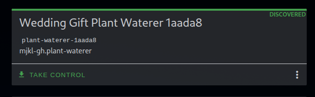

# Firmware aanpassen

Als je uitgekeken bent op de firmware die ik voor je gemaakt heb kan je deze aanpassen. Hier zijn meerdere mogelijkheden voor.

De firmware wordt gecompileerd door esphome op basis van een `yaml` configuratie bestand. In het geval van mijn firmware bestaat de configuratie uit

``` yaml

--8<-- "firmware/plant-waterer.yaml"

```

Door dit bestand aan esphome te geven zal het eerst de benodige C(++) code genereren. Vervolgens zal het de code compileren om een bestandje maken wat je kan gebruiken om de microcontroller te flashen. Dit kan op de volgende manieren:

Dingen die je mogelijk zou willen aanpassen:

- Pinnummers waar sensoren of de pump aangesloten zitten
- Calibratiewaarden aanpassen van de analoge sensor
- Het script aanpassen wat de plant bewaterd
- Extra sensoren toevoegen, bijvoorbeeld een [BME680 environmental sensor](https://esphome.io/components/sensor/bme680/)
- Extra automatiseringen toevoegen via [actions](https://esphome.io/automations/actions/) of [scripts](https://esphome.io/components/script/)

## Esphome add-on

Als je al home assistant thuis hebt, en daarbij de "Esphome Builder" add-on. Kan je in de add-on "Take control" activeren op de plant-waterer. De add-on zal dan mijn configuratie uit de repo downloaden en beschikbaar maken. Deze kan je dan naar hartelust aanpassen. Bijvoorbeeld als je de analoge sensor wilt kalibreren. De esp kan vervolgens via "Over-The-Air" updates via wifi ge-update worden.



## De repository forken

Door naar de git repository te gaan (zie de link in de rechter boven hoek). Kan je de broncode van deze website, maar ook van de firmware in zien. Deze repo is geconfigureerd om automatisch de firmware te compileren. Dit gebeurt via github actions.

Als je de repository "forked" door op de pagina op "fork" te klikken, maak je een eigen kopie van de repository. Vervolgens kan je in de editor online het bestandje in de map "firmware" genaamd plant-waterer.yaml aanpassen. Als dit "commit" op je eigen fork. Zal de github action automatisch een nieuwe firmware releasen. Deze kan je vervolgens downloaden onder "releases."
