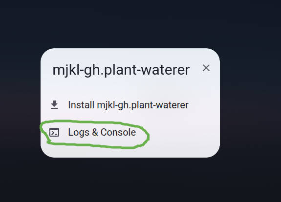
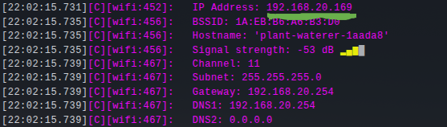

# De firmware flashen

Hier lees je alles over het flashen van de firmware. Mocht je klaar zijn met de standaard firmware die ik meelever? Pas hem aan! Volg deze [link](../bonus/modifying-firmware.md) naar de bonuspagina om te leren hoe je je eigen firmware schrijft

## Flashen

Om de firmware naar de microcontroller te flashen moeten we de microcontroller via usb aansluiten op onze computer. Haal de microcontroller uit de verpakking en sluit hem direct aan op je computer zoals in onderstaande foto

Het is hierbij belangrijk dat je de usb-c connector op de micro controller zelf gebruikt en niet die op het proto-board er onder.

Vervolgens ga je naar de [flash-pagina](../flash.md) en klik je op connect om te verbinden met de micro controller. Installeer dan de laatste versie van mjkl-gh.plant-waterer.

De firmware is gebaseerd op Esphome. Hierdoor is het super makkelijk om een configuratie te schrijven en deze te compileren. Of om deze configuratie aan te passen. De configuratie van deze firmware vind je [hier](https://github.com/mjkl-gh/wedding-gift-for-guests/blob/main/firmware/plant-waterer.yaml)

## Verbinding maken met wifi

Nu de microcontroller geflasht is kan deze verbonden worden met je wifi netwerk. Deze stap is optioneel, maar door dit te doen kan je onder andere updaten via wifi. De sensor waarden uitlezen en de pomp handmatig activeren.

Dit kan op meerdere manieren. Namelijk:

### Home assistant

 Voor mensen die al een [Home assistant](../about/home-assistant.md) installatie hebben met bluetooth proxy of de app gebruiken. Home assistant detecteert het nieuwe apparaat automatisch. Wil je Home assistant eens uitproberen. Ik kan je op weg helpen, lees meer hier over op de pagina achter de [link](../about/home-assistant.md). Open de app en ga naar Settings->Integrations&Devices en hier zal een nieuw apparaat ontdekt zijn. Voeg dit apparaat toe (Home assistant zal om je wifi wachtwoord vragen) en alles zou moeten werken vanaf hier

### Improv serial

Als je op de[flash-pagina](../flash.md) nog verbonden bent of opnieuw verbind, zal de pagina automatisch detecteren dat het zogenaamde "Improv serial" protocol actief is op de micro controller. Door op "Configure Wi-Fi" te klikken en het wifi netwerk en wachtwoord naar keuze in te vullen. Zal de micro-controller verbinding maken met het lokale wifi netwerk.

### Improv Ble

Een andere optie is het Improv bluetooth protocol te gebruiken. Door naar de [improv website](https://www.improv-wifi.com/) te gaan op een apparaat met bluetooth. Kan je de micro-controller verbinden met je wifi netwerk.

Klik op de grote knop "Connect device to wifi." Je apparaat zal nu via bluetooth scannen naar apparaten die het Improv Ble protocol ondersteunen. Zoals de zojuist geflashte microcontroller.  Je apparaat zal nu onder andere een apparaat vinden genaamd "plant-waterer-xxxx" waarbij xxxx staat voor een uniek id wat gegenereerd is.

Klik op plant-waterer-xxxx en vul je wifi gegevens in om het te laten verbinden

## Verbinding maken met het dashboard

Nu de micro controller aan je netwerk hangt kunnen we kijken of we bij het dashboard kunnen komen. Dit kan op verschillende manieren

### Home assistant

Als je al Home assistant hebt is dat veruit de makkelijkste optie. Ga in de app op of op de webpagina naar `Settings->Devices&Services->Esphome->Wedding Gift Plant Waterer xxxxxx` en klik op `Visit` Je webbrowser zou nu moeten openen op het dashboard.

### Via mDNS

Voor mensen zonder home assistant niet getreurd. De module kondigt zichzelf aan via je wifi netwerk. Ga naar [plant-waterer.local](http://plant-waterer.local) en je laptop zal het dashboard openen in je webbrowser. Gezien dit via zogenaamde "Broadcast" berichten gaat is dit niet altijd even betrouwbaar. 

??? Info "Werkt het niet?"

    Het kan zijn dat je een bericht krijgt dat je webbrowser geen verbinding kon maken. Met name op windows laptops van werk, kan het slecht werken. Dit komt omdat Microsoft in het verleden zich niet aan afspraken en standaarden gehouden heeft. En `.local` adressen anders ingezet heeft.

### Via Serial

Als mDNS niet werkt kunnen we ook het ip adres achterhalen via de seriële poort. Verbind de microcontroller weer met de computer en ga weer naar de [flash pagina](../flash.md). Je kan hier op Logs&Console klikken om verbinding te maken

Als je nu op `Reset device` klikt zal de microcontroller opnieuwe opstarten. 1 van de berichten tijdens het opstarten bevat het zogenaamde ip adres zoals hieronder:

Typ dit adres in de de adresbalk van je webbrowser om de pagina te bezoeken. Zoals `http://<ip adres in de logs>`, bijvoorbeeld `http://192.168.1.33`

### Via je router

Mocht je de microcontroller even buiten handbereik zijn, kan je het ip adres vaak ook opzoeken in de router. Dit is het kastje wat je vaak van je provider gekregen hebt en je huis van internet voorziet. Dit appraat deelt de adressen uit en houd hier vaak een logboek van bij. Hoe je deze informatie er echter uit kan halen verschild enorm per fabrikant. Vaak is de router te bereiken op een adres als `192.168.1.1` het specifieke adres staat op je laptop onder netwerk instellingen als "Default gateway"

Als je vervolgens inlogt op de router zal er onder iets als "Netwerk" een apparaat aangemeld staan als `plant-waterer`. Bezoek het hierbij genoemde ip-adres om het dashboard te bezoeken.