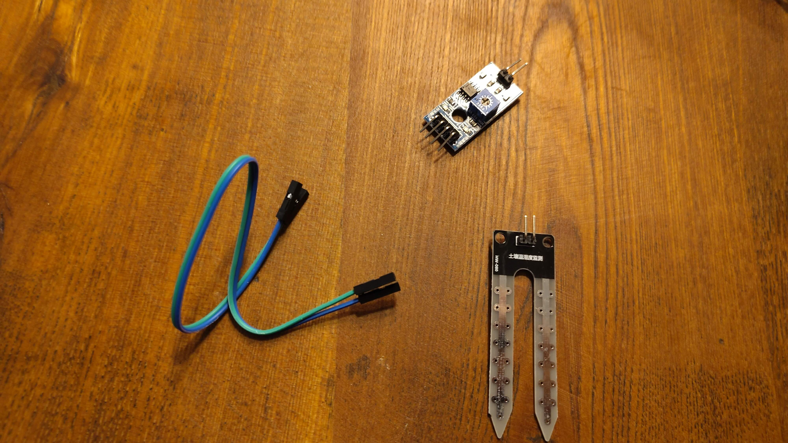
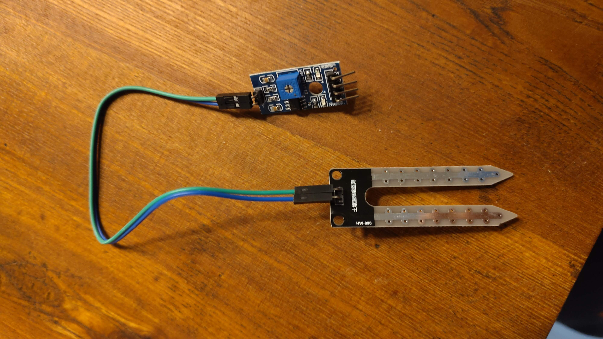
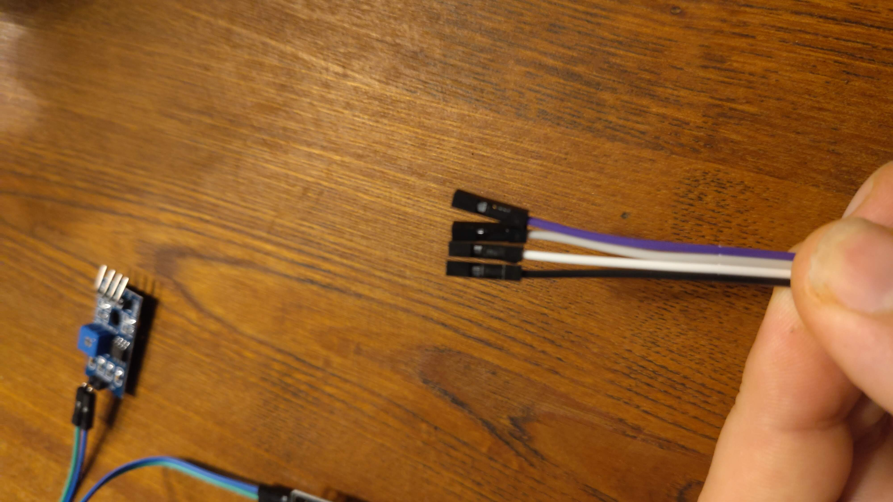
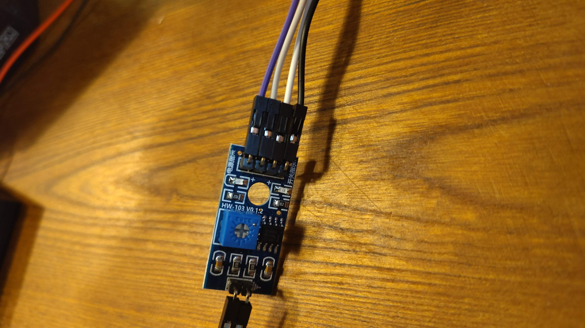
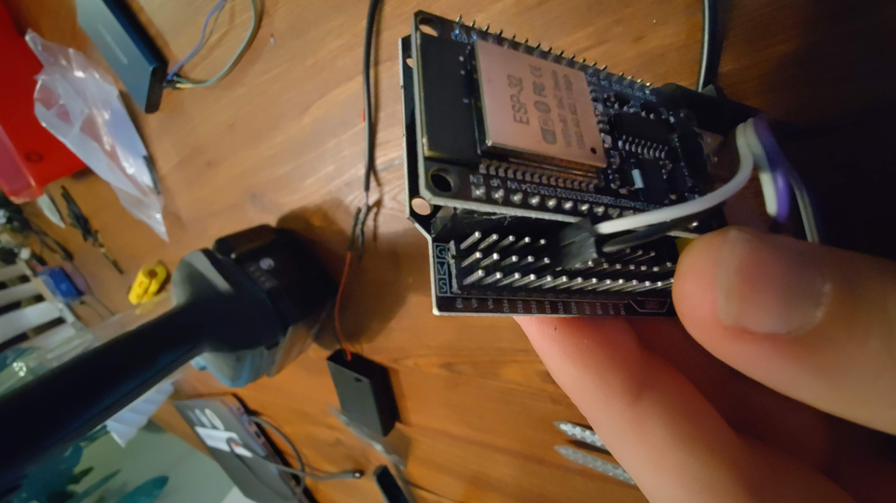
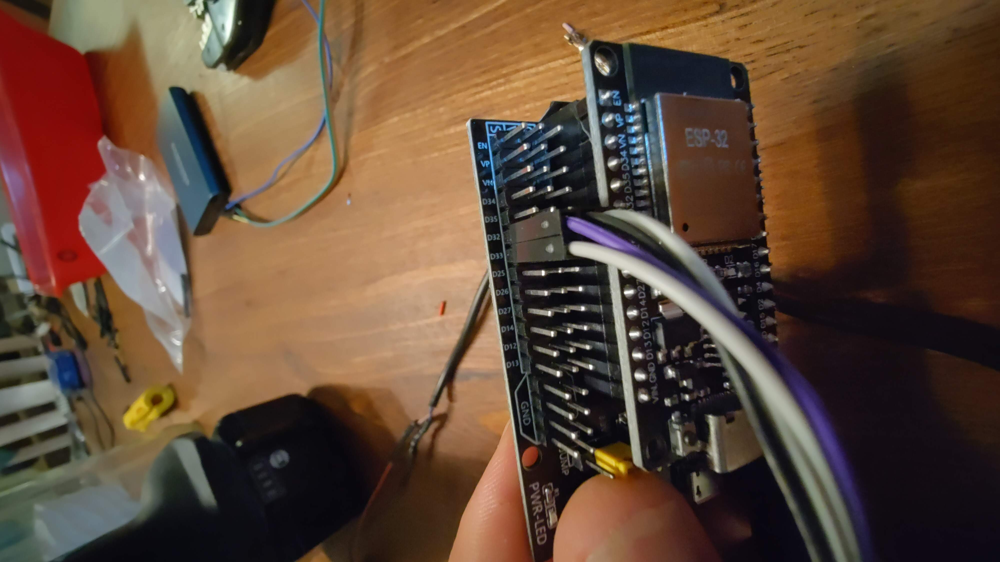

# Aansluiten van de sensoren

## Microcontroller op development board

Nadat de microcontroller geflasht is kunnen we hem op het zogenaamde "development board" prikken.

!!! warning
    Zorg dat hij hierbij in de goede richting staat anders matchen de pinnen niet en kan je de microcontroller beschadigen als je er spanning op zet!

Voor het aansluiten van de sensoren gebruiken we de kabeltjes die bij de sensor in de verpakking zaten. De connectoren die hier aan zitten heten zogenaamde "Dupont" stekkers.

## Capacitieve sensor vork

De vork-achtige sensor verbind je met 2 kabeltjes aan het "versterker" bordje. Zoals hieronder:

De richting zou hier niet uit moeten maken omdat het hier om een passieve sensor gaat

## Versterker met esp32 development board verbinden

Nu gaan we de sensor met de esp32 verbinden. Zorg eerst dat je 4 kabeltjes bij elkaar hebt zoals hieronder:

En verbind deze met het versterker-printje:

Let vervolgens goed op welke kabels je met `D0`, `A0`, `VCC` en `GND` verbind.

Verbind deze vervolgens met de juiste pinnen op de esp32. Hier hebben we voor elke pin `G`(round) `V`(oltage) en `S`(ignal).

Verbind eerst `GND` met `G` en `VCC` met `V` zoals hieronder:

En verbind vervolgens de signaalpinnen met de juiste pinnen. Namelijk `D32` voor `A0` en `D33` voor `D0

Als je de usb print nu een usb voeding hangt kan je het dashboard bezoeken zoals genoemd onder [Verbinding maken met het dashboard](01-flashing-firmware.md#verbinding-maken-met-het-dashboard)

Je zal nu zien dat de waarden op het dashboard matchen met de sensoren, mits je ze goed aangesloten heb. Pak een glas water erbij en je kan de sensor testen.

Als je dit hebt aangesloten kan je verder met [de pomp aansluiten](03-pump.md)
