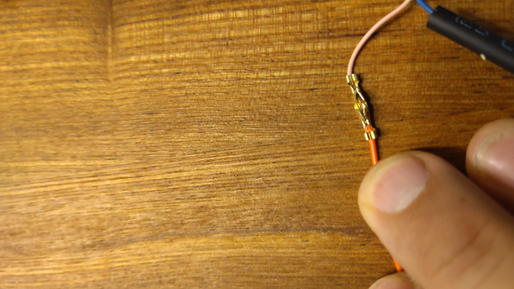

# Aansluiten van de pomp

Nu de sensoren aangesloten zijn kunnen we de pomp gaan aansluiten. Hiervoor zullen we helaas in de kabels moeten knippen. Pak dus het volgende gereedschap erbij:

- kniptang
- hittebron (heatgun, verfstripper, föhn aansteker of gaspit)
- tang
- kleine schroevendraaier
- striptang (optioneel)
- stekkertang (optioneel)

Waarschijnlijk zullen velen van jullie geen stekkertang kennen. Maar deze vergemakkelijkt het dichtknijpen van de verbinders aanzienlijk. Zelf heb ik er 1 van de Parkside (van de Lidl) zoals hieronder:

## Relais aansluiten

We gaan eerst het relais aansluiten.

!!! Warning
    Zorg dat je alleen kabels aansluit als de microcontroller uit staat. Dus niet aan een voeding of laptop hangt

Dit kan met 3 vrouwtje-vrouwtje kabels met Dupont-stekkers. Schuif deze over de connector heen

Let goed op de `IN` `GND` en `VCC` namen van de pinnen. Sluit deze vervolgens correct aan op de micro controller

Zorg dat `GND` op `G` komt, `VCC` op `V` en `IN` op `S` van `D23`

Als je nu de microcontroller weer aan een voeding hangt en het dashboard bezoekt zal je merken dat als je de toggle "Water pump" activeert, je het relais hoort klikken. Na 3 seconden klikt het relais weer terug. Dit is om te voorkomen dat de plant teveel water krijgt als de pomp er eenmaal aanhangt.

## Pomp aansluiten op relais

We gaan nu het pompje aan het relais hangen.

Knip hiervoor 1 van de de Dupont-kabeltjes (bijvoorbeeld een blauwe) door, Deze gaat verbonden worden met de voeding vanuit de microcontroller. Pak de geknipte kant en strip hier 3mm van de kabel af. Gebruik hiervoor een striptang, of zet de kniptang er voorzichtig op en trek de mantel naar je toe. ALs je hard genoeg trekt zal de mantel achter je kniptang loslaten.

Stop deze kabel in de middelste uitgang van het relais. Let hier niet op de rode draad deze zit nog in de verkeerde poort.

Schroef de draad onder de klem vast.

!!! Warning
    Klem de kabel op koper in. Als je hem inklemt op de kabelmantel kan deze geen contact maken. Laat ook niet teveel koper uitsteken. Dit verhoogt de kans op kortsluiting

Pak nu de pomp erbij en verbind de rode draad met de rechter schroefklem. Zoals hieronder weergegeven:

## Pomp aansluiten op microcontroller

We kunnen nu de pomp aansluiten op microcontroller. Knip nu een andere kleur kabel door. Je kan ook het andere eind van de blauwe hergebruiken. Maar dit verhoogt de kans op het fout aansluiten van de pomp, dus gebruik bij voorkeur een andere kleur.

Deze kabel zullen we aan de zwarte draad van de pomp moeten krimpen. Eerst zullen we de zwarte krimpkous over de draad schuiven. Dat moet nu omdat dit later niet meer gaat!

Pak het gouden connectortje en legt de zwarte draad daarin. Hij ligt goed als de eerste metalen klem bij de mantel zit en de tweede bij het koper. De eerste houdt namelijk de kabel stevig vast. De tweede maakt de verbinding. Zoals hieronder:

"Krimp" nu de connector. Dit kan met de krimptang, of door met een normale tange de oortjes dicht te vouwen. Doe eerst de buitenste zodat de kabel goed ingeklemd zit. Klem daarna de 2e oortjes (nog steeds aan dezelfde kant van het midden) om het koper.

Nu de eerste kabel vast zit kunnen we de 2e kabel invoeren en krimpen. Herhaal hetzelfde proces als voor de eerste:

En schuif vervolgens de krimpkous over de verbinding en hou deze bij een hittebron om hem om de verbinding te laten krimpen:

!!! Warning
    Bij deze foto zit de rode draad nog in de verkeerde uitgang van het relais.

Nu kan de pomp met de microcontroller verbonden worden. Verbind de kabel die naar het midden van het relais loopt met `VCC` en de kabel die verbonden is met de zwarte draad van de pomp met `GND`. Zoals:

## Testen

De pomp zou nu correct aangesloten moeten zijn op de microcontroller. Je kan dit testen door de micro controller aan de voeding te hangen. En vervolgens via de website de "Water pump" toggle te activeren.

Als dit allemaal werkt kan je naar de laatste stap de [batterijen aansluiten](./04-batteries.md)