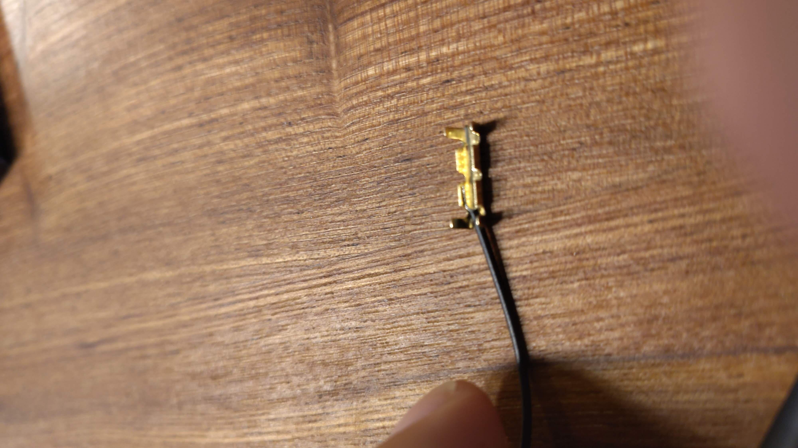
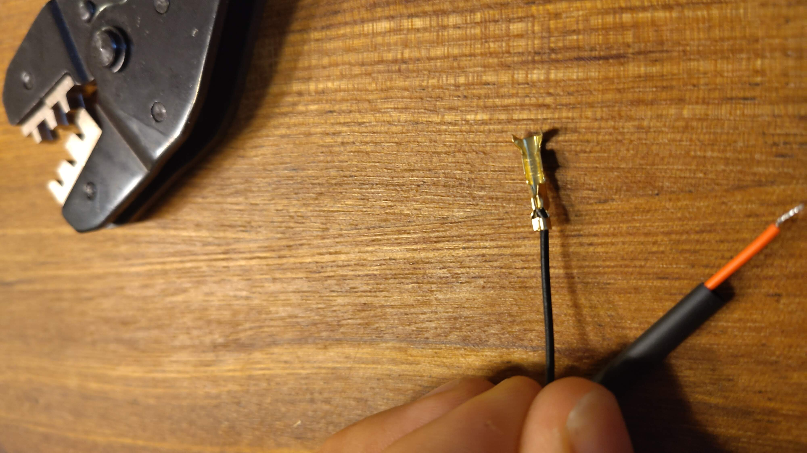
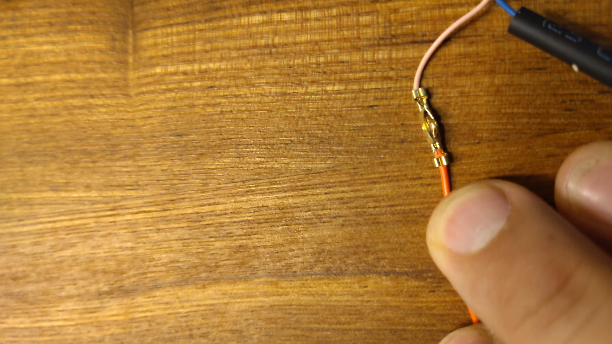
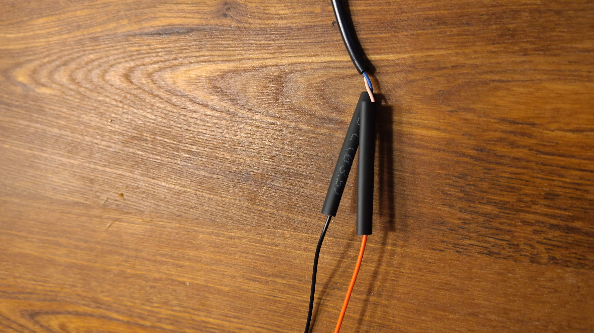

# Aansluiten van de batterijen

Dan komt nu het stuk waar het hopelijk allemaal samenkomt. het aansluiten van de batterijen. Echter voordat we de batterijen kunnen aansluiten, moeten een kabel gereed maken. Hiervoor heb je het volgende gereedschap nodig:

- Zijkniptang
- Hittebron (hittepistool, verfstripper, föhn, gaspit of als laatste redmiddel een aansteker)
- Striptang (optioneel)
- Stekkertang (optioneel)

Bij de set zat een kabel usb naar 5.5mm "DC barrel jack". Deze hebben we nodig, maar zonder de usb stekker. Deze kan je er dus afknippen met de zijkniptang. Strip vervolgens een stuk mantel van 3cm van de usb kabel af. Zorg dat de mantel van de binnenkabels hierbij heel blijft! 

Als dit gelukt is strip je de uiteinden van de usb kabels een 0.5cm af. Doe dit heel voorzichtig de usb kabel is erg dun en dus fragiel. Deze gaan we weer verbinden met de kabel die uit de batterijdoos komt.

Schuif eerst 2 krimpkousen over de rode en zwarte batterijkabel. Deze moeten uiteindelijk om de connector gekrompen worden.

Leg de roze kabel in een krimpconnector, met de mantel in het eerste lipje en het gestripte in de tweede zoals hieronder:

Knijp de connector dicht door de lipjes dicht te vouwen. Eerst het limpje om de mantel dan het lipje om de gestripte kabel. Of gebruik een stekker krimptang

Leg nu de rode kabel van de batterijdoos in het andere uiteinde. Herhaal het proces.

Krimp vervolgens op dezelfde manier de zwarte kabel op de blauwe.

Schuif nu de krimpkous over de connectoren

Gebruik nu een hittebron om de krimpkousen om de connectoren te krimpen. De batterijkabel is nu af. Als je er klaar voor bent kan je de connector in het PCB schuiven. Stop 4 AAA batterijen in de batterijhouder. Als je het schuifje op de batterijhouder omzet, zouden er lampjes moeten gaan branden en zou het project tot leven moeten komen.

Gefeliciteerd, Als alles goed is gegaan heb je nu een werkende opstelling. Nu kunnen we doorgaan met [testen en afstellen](05-testing.md)
